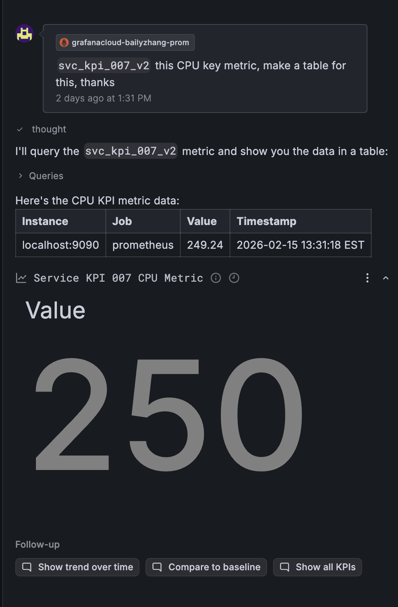
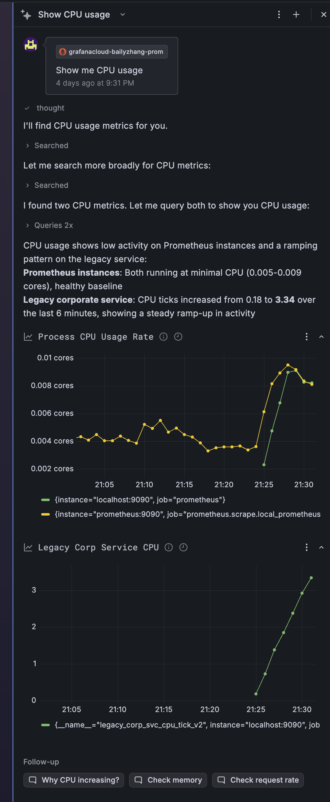
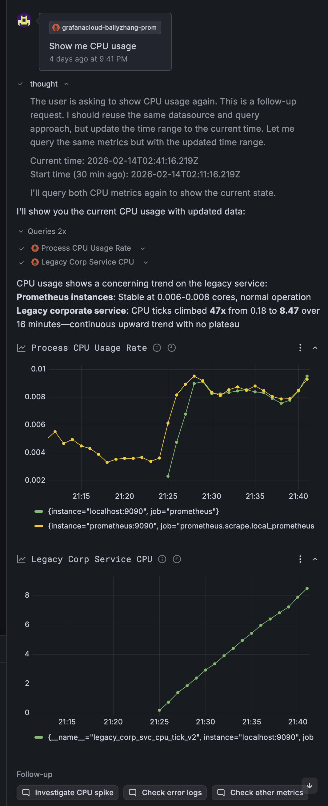
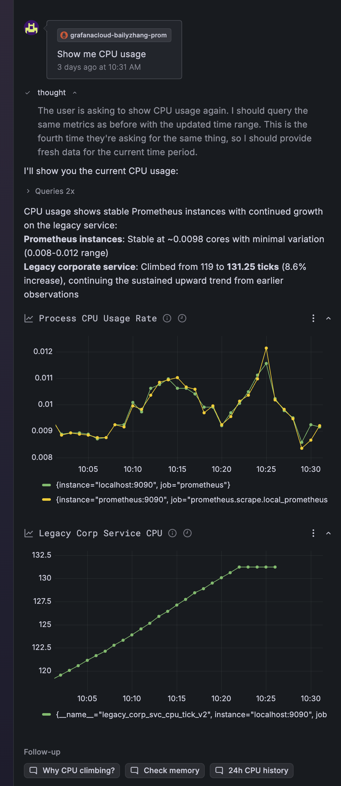
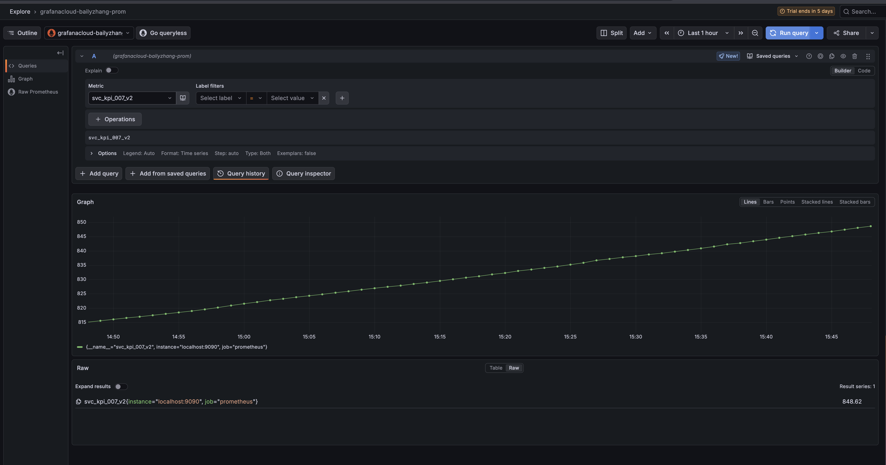
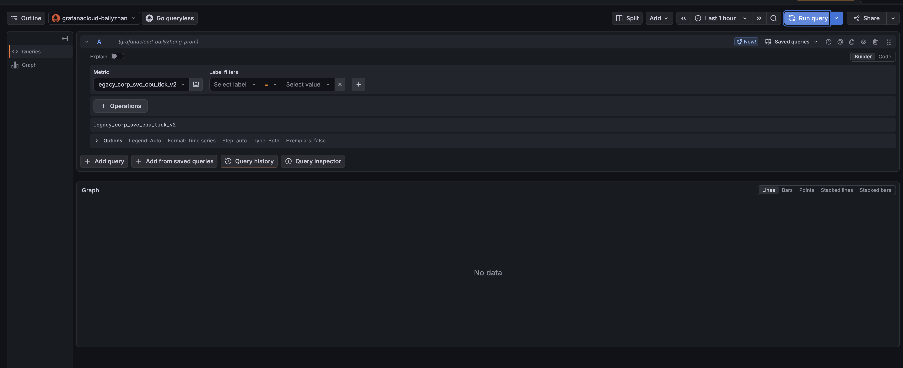

# Experiment: Grafana Assistant Metric Discovery Gap

## Summary

When Grafana Assistant encounters **opaque (non-semantic) metric names**, its ability to discover and query metrics drops to **0%**. This poses a growing risk as the Assistant evolves from query assistance to full dashboard authoring via the [DashboardMutationAPI](https://github.com/grafana/grafana/issues/118487).

## Background

Grafana Assistant relies heavily on metric name semantics to understand what a metric represents. In well-named environments (e.g., `node_cpu_seconds_total`), this works well. But enterprise environments often use:

- Legacy naming conventions (`legacy_corp_svc_cpu_tick_v2`)
- Internal codenames (`svc_kpi_007_v2`)
- Auto-generated identifiers from provisioning tools

These names carry no semantic signal for the LLM to interpret.

## Setup

**Environment:**
- Prometheus (local) → Grafana Cloud via remote_write
- Grafana Cloud instance: `grafanacloud-bailyzhang-prom`
- Two metric categories pushed simultaneously:
  - **Semantic metrics**: Standard Prometheus self-monitoring metrics (`process_cpu_seconds_total`, etc.)
  - **Opaque metrics**: Custom recording rules with enterprise-style naming (`svc_kpi_007_v2`, `legacy_corp_svc_cpu_tick_v2`)

**Recording rules** ([`rules.yml`](rules.yml)):
```yaml
groups:
  - name: opaque_metrics
    rules:
      - record: svc_kpi_007_v2
        expr: process_cpu_seconds_total * 1000
      - record: legacy_corp_svc_cpu_tick_v2
        expr: rate(process_cpu_seconds_total[1m]) * 100
```

Both metrics are mathematically derived from the same underlying CPU data, but with names that strip away all semantic context.

## Test Protocol

### Test A: Opaque metric — direct query request

**Prompt:** `svc_kpi_007_v2 this CPU key metric, make a table for this, thanks`

**Result:** The Assistant successfully queried the metric when given the **exact name** and told it was CPU-related. It rendered a table with the value (249.24) and auto-titled the panel "Service KPI 007 CPU Metric."



**Key observation:** The Assistant can execute a query when handed the metric name directly, but it **invented a panel title** ("Service KPI 007 CPU Metric") based on tokenizing the metric name — not from understanding what the metric actually measures. The title sounds plausible but is misleading: this metric is `process_cpu_seconds_total * 1000`, not a "KPI."

### Test B: Opaque metric — discovery via natural language

**Prompt:** `Show me CPU usage`

**Result:** The Assistant searched for CPU metrics and found **two**: `process_cpu_seconds_total` (the standard Prometheus metric) and `legacy_corp_svc_cpu_tick_v2` (our opaque metric).



Critically, it **did not find `svc_kpi_007_v2`** despite it being derived from CPU data. The metric name contains no "cpu" substring, so the Assistant's search heuristic missed it entirely.

### Test C: Repeated queries — consistency check

The same prompt ("Show me CPU usage") was repeated across multiple sessions to test consistency:




**Consistent finding:** The Assistant always discovered `legacy_corp_svc_cpu_tick_v2` (because the name contains "cpu") but **never discovered `svc_kpi_007_v2`**. Discovery is driven by string matching on metric names, not by understanding what the metric measures.

### Test D: Opaque metric — zero discovery

**Prompt:** `legacy_corp_svc_cpu_tick_v2` queried directly in Grafana Explore.



The metric exists and returns data. But without the "cpu" substring in the name, the Assistant would never surface it in response to a natural language query about CPU.

**Prompt:** `legacy_corp_svc_cpu_tick_v2` queried — returned **"No data"** in certain configurations.



This demonstrates that even when the metric name partially contains semantic hints ("cpu", "tick"), configuration issues (data source selection, time range) can further degrade discoverability.

## Results Summary

| Test | Metric | Discovery Method | Found? | Correct Context? |
|------|--------|-----------------|--------|-----------------|
| A | `svc_kpi_007_v2` | Exact name given | ✅ | ❌ (invented title) |
| B | `svc_kpi_007_v2` | Natural language "CPU usage" | ❌ | N/A |
| B | `legacy_corp_svc_cpu_tick_v2` | Natural language "CPU usage" | ✅ | ⚠️ (found via substring) |
| C | `svc_kpi_007_v2` | Repeated natural language | ❌ (0/3) | N/A |
| D | Both metrics | Direct Explore query | ✅ | N/A (manual) |

**Discovery rate for fully opaque names (no semantic substring): 0%**

## Implications for DashboardMutationAPI

As the Assistant gains dashboard authoring capabilities ([#118487](https://github.com/grafana/grafana/issues/118487)), the failure mode shifts:

| Capability | Wrong metric impact | User visibility |
|-----------|-------------------|-----------------|
| **Query assistance** (today) | Query returns wrong data or errors | **High** — user sees the query and can re-ask |
| **Panel auto-generation** (planned) | Dashboard renders with wrong metric | **Low** — panel looks correct, shows wrong data |
| **Full dashboard authoring** (future) | Multiple panels with wrong metrics | **Very low** — compound errors across panels |

The risk scales with the mutation surface. A per-datasource **metric knowledge base** — mapping opaque names to semantic descriptions and common query patterns, bootstrapped from label metadata and user corrections — could provide the context layer the MutationAPI needs.

## Proposed Mitigation: Self-Correcting Knowledge Base

```
┌─────────────────────────────────────────────────────────────┐
│                   Metric Knowledge Base                      │
│                                                              │
│  svc_kpi_007_v2                                             │
│  ├── description: "API latency P99 for payment service"     │
│  ├── unit: milliseconds                                     │
│  ├── team: fintech                                          │
│  ├── common_queries:                                        │
│  │   └── histogram_quantile(0.99, rate(...[5m]))           │
│  └── source: user_correction (2024-02-15)                   │
│                                                              │
│  legacy_corp_svc_cpu_tick_v2                                │
│  ├── description: "CPU tick rate for legacy corp service"   │
│  ├── unit: ticks/second                                     │
│  ├── team: infrastructure                                   │
│  ├── common_queries:                                        │
│  │   └── rate(legacy_corp_svc_cpu_tick_v2[5m])             │
│  └── source: label_inference + user_confirmation            │
└─────────────────────────────────────────────────────────────┘
```

**Bootstrap sources:**
1. **Label metadata** — Extract `job`, `team`, `unit` labels to infer context automatically
2. **LLM inference** — Use the model to generate initial descriptions from available signals
3. **User corrections** — Capture corrections when users fix AI mistakes, creating a feedback loop

Over time, the knowledge base becomes increasingly accurate through the self-correcting flywheel: AI makes a guess → user corrects → system learns → next query is better.

## Reproduction

```bash
# Clone this repo
git clone https://github.com/baily-zhang/grafana-research.git
cd grafana-research

# Set up credentials
cp .env.example .env
# Edit .env with your Grafana Cloud credentials

# Start the stack
docker compose up -d

# Verify metrics are flowing
curl -s localhost:9090/api/v1/query?query=svc_kpi_007_v2 | jq '.data.result[0].value'
```

Then open Grafana Assistant and try:
1. "Show me CPU usage" — observe which metrics are discovered
2. "Query svc_kpi_007_v2" — observe the auto-generated context
3. Compare with "Query process_cpu_seconds_total" — observe the difference in understanding

## Related

- [#118487 — Assistant better integration with Dashboards](https://github.com/grafana/grafana/issues/118487)
- [#115684 — Assistant metric discovery issues](https://github.com/grafana/grafana/issues/115684)
- [Reddit: Grafana AI Assistant and data from PDC sources](https://www.reddit.com/r/grafana/comments/1qz5qzp/grafana_ai_assistant_and_data_from_pdc_sources/)
